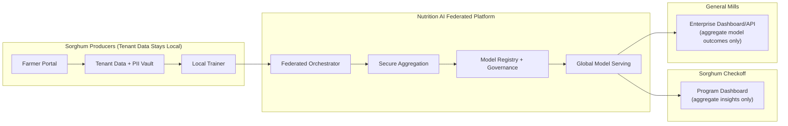

# Federated Multi-Tenant Implementation Plan

## 1) Objective

Build a multi-tenant, privacy-preserving Nutrition AI platform where:
- farmers access their own identifiable data and recommendations,
- checkoff and enterprise users consume aggregated intelligence,
- model training uses federated learning so raw tenant data is not centrally pooled.

## Picture (Target Flow)

## 2) Success Criteria

- 100% tenant-scoped data access enforced on all APIs.
- 0 unauthorized cross-tenant data reads in security tests.
- Federated training round completes across >= 2 tenants with successful aggregation.
- Enterprise/checkoff APIs expose only aggregate-safe outputs.
- Auditable lineage from training round -> model version -> deployment.

## 3) Scope and Assumptions

In scope:
- tenancy, authz policy, data isolation, federated training orchestration, aggregate serving.

Out of scope (initial release):
- full on-device FL for individual phones/devices,
- advanced cryptography (MPC/HE) beyond secure aggregation baseline.

## 4) Workstreams

1. Identity, tenant model, and access control.
2. Data architecture and PII separation.
3. Federated training control plane.
4. Model governance and deployment.
5. Customer-facing aggregate APIs and dashboards.
6. Security, audit, and compliance controls.

## 5) Phase Plan

## Phase 0: Discovery and Architecture Baseline (Week 1-2)

Deliverables:
- final tenant taxonomy and role matrix
- data classification policy (`PII`, `tenant-sensitive`, `aggregate-safe`)
- federated round protocol spec

Acceptance:
- architecture and policy docs approved by product + security owners.

## Phase 1: Tenant Foundation + AuthZ (Week 3-5)

Deliverables:
- new entities: `tenants`, `tenant_users`, `tenant_roles`, `policy_rules`
- auth middleware enforcing tenant context on each request
- admin tooling for tenant provisioning

Acceptance:
- integration tests prove no cross-tenant API reads/writes.

## Phase 2: Data Isolation + PII Vault (Week 6-8)

Deliverables:
- tenant partition strategy (schema-per-tenant default)
- PII vault/table split with tokenized references
- migration pipeline for existing records

Acceptance:
- PII never returned by aggregate endpoints.
- data export reports prove separation works.

## Phase 3: Federated Training MVP (Week 9-12)

Deliverables:
- federated orchestrator service
- tenant local trainer service contract
- secure aggregation service
- round scheduling and retry logic
- new `federated_rounds` and `federated_participants` tracking tables

Acceptance:
- run 3 successful federated rounds across at least 2 tenant silos.
- aggregated model appears in model registry with full lineage.

## Phase 4: Aggregate Consumption Layer (Week 13-15)

Deliverables:
- checkoff aggregate insight API
- enterprise aggregate model API for General Mills use cases
- suppression thresholds for small cohorts
- dashboard/BI contract for aggregated KPIs

Acceptance:
- enterprise user cannot query farm-identifiable rows.
- checkoff dashboards pass anonymization checks.

## Phase 5: Hardening and Production Rollout (Week 16-18)

Deliverables:
- alerting, drift monitoring, rollback workflow
- penetration test and threat model closure
- SLOs and runbooks

Acceptance:
- production readiness sign-off from platform, ML, and security owners.

## 6) Data Model Changes (High-Level)

Add:
- `tenants`, `tenant_memberships`, `tenant_policies`
- `pii_identity_map` (or external vault pointers)
- `federated_rounds`, `federated_round_participants`, `federated_artifacts`
- `aggregate_kpi_snapshots`

Update existing domain tables:
- add `tenant_id` to tenant-owned records
- enforce composite indexes including `tenant_id`

## 7) API Plan

New API families:
- `/api/v1/tenants/*` (admin + tenant admin management)
- `/api/v1/federated/*` (round control, status, artifacts)
- `/api/v1/checkoff/*` (aggregate analytics)
- `/api/v1/enterprise/*` (aggregate model outputs)

Policy:
- every endpoint declares required role + scope + data classification.

## 8) Security Controls

- mTLS between tenant trainers and orchestrator.
- signed model artifacts and checksums.
- immutable audit logs for access/training/deployment actions.
- secret rotation for keys/tokens.
- minimum cohort thresholds for aggregated reports.

## 9) Risks and Mitigations

| Risk | Impact | Mitigation |
|---|---|---|
| Uneven tenant data quality | weak global model | per-tenant quality gates, weighted aggregation |
| Low tenant participation in rounds | unstable training cadence | fallback scheduling + quorum rules |
| Privacy leakage through aggregates | regulatory and trust risk | suppression thresholds + DP + strict policy checks |
| Operational complexity | delayed launch | phased rollout, strong runbooks, staged environments |

## 10) Rollout Strategy

- Pilot tenants first (1 producer cohort + 1 checkoff + 1 enterprise sandbox).
- Run shadow federated rounds against existing centralized model for comparison.
- Promote only when federated model meets agreed quality and privacy gates.
- Gradually migrate enterprise endpoints to federated-backed models.

## 11) Immediate Next 30 Days (Execution Checklist)

1. Finalize tenant and role matrix (product + legal + security).
2. Implement `tenant_id` propagation in backend models and CRUD.
3. Introduce policy middleware and endpoint-level policy mapping.
4. Stand up federated round tables and orchestrator skeleton.
5. Define enterprise/checkoff aggregate endpoint contracts.
