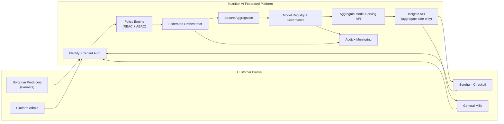
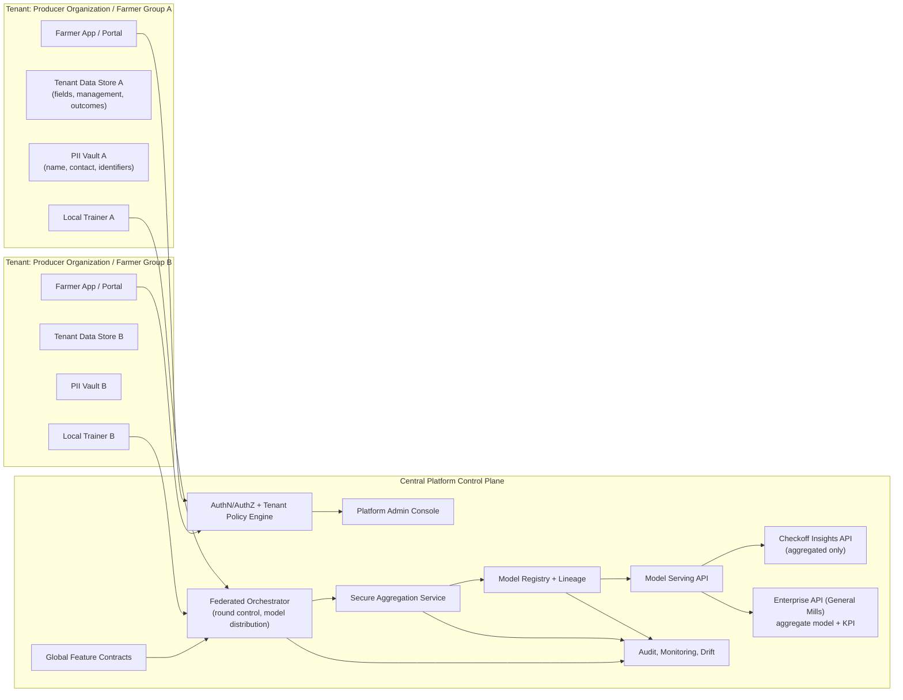
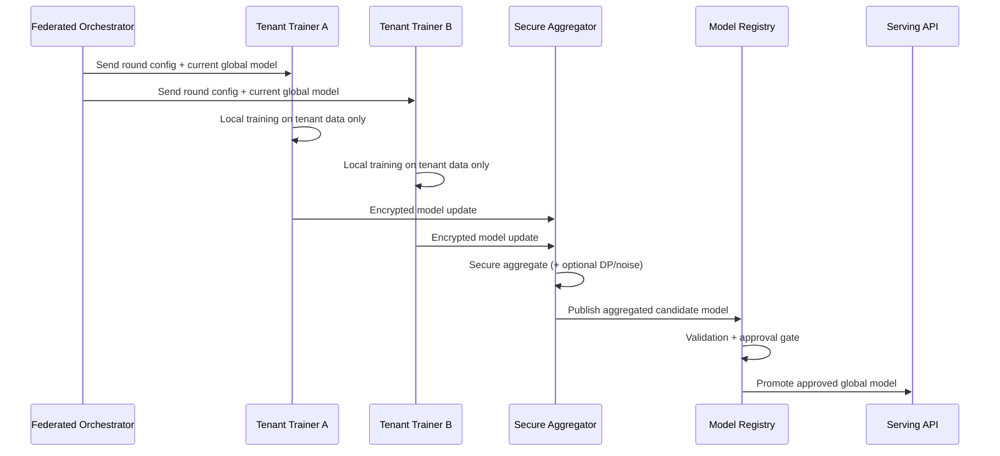

# Federated Multi-Tenant Architecture (Sorghum Platform)

## 1) Context and Goal

This document defines a next-generation architecture for Nutrition AI with:
- multiple tenants (beyond platform admin)
- privacy-preserving/federated training
- shared aggregate model usage for enterprise buyers
- strict protection of farmer personal and farm-identifiable data

Target customers and needs:

| Customer | Primary Need | Data Access Pattern |
|---|---|---|
| Sorghum producers (farmers) | Better decisions for yield/nutrition and full visibility into their own records | Can see and manage own data only |
| Sorghum checkoff (grower organization) | Program-level insights, adoption metrics, benchmarking across members | Aggregated/anonymized program views; no raw PII exposure |
| General Mills (enterprise buyer) | Reliable, consistent yield and nutrition outcomes for supply planning | Consume aggregate model outputs and enterprise KPIs, no personal data |

## 2) Design Principles

- Tenant isolation first: each tenant has strict data boundaries.
- Privacy by default: PII separated and minimized.
- Federated-by-design: raw tenant data remains in tenant boundary during training.
- Aggregate value delivery: enterprise gets global model intelligence, not individual records.
- Auditability: every data access, model round, and deployment is traceable.

## 3) Proposed Logical Architecture

### Customer Block Flow Diagram

### Detailed Logical Architecture

## 4) Data and Privacy Boundaries

### Data classes
- `PII`: farmer names, contacts, exact identifiers.
- `Tenant-sensitive`: field-level raw operations/outcomes that can identify a farm.
- `Aggregate-safe`: anonymized metrics, model weights/updates, cohort KPIs.

### Boundary rules
- PII stored in tenant-specific vault/storage only.
- Raw tenant datasets do not leave tenant boundary for training.
- Only encrypted model deltas/gradients are sent to the central aggregator.
- Enterprise and checkoff views consume aggregate outputs and thresholded cohorts only.

## 5) Tenant and Role Model

Core roles:
- `platform_admin`: operates platform, cannot casually read tenant PII.
- `tenant_admin`: manages users/config for one tenant.
- `farmer_user`: accesses only own farm/field data and recommendations.
- `checkoff_analyst`: accesses aggregated cross-member dashboards.
- `enterprise_analyst`: accesses aggregate model outputs and supply KPIs.

Access model:
- RBAC + ABAC (`tenant_id`, `organization_id`, `data_classification`, `purpose`).
- Policy decision point enforced on all APIs and query paths.

## 6) Federated Learning Lifecycle (Cross-Silo)

## 7) Model Strategy

- Global aggregate model: used for checkoff and enterprise experiences.
- Optional tenant-personalized heads:
  - global backbone + tenant calibration layer
  - keeps local relevance without exposing raw local data.
- Release policy:
  - staging validation
  - bias/fairness and drift checks
  - controlled rollout (canary by tenant cohort)

## 8) Operational Controls

- Encryption in transit: TLS/mTLS between tenant trainers and orchestrator.
- Key management: KMS-backed key rotation for model artifacts and secrets.
- Audit trails:
  - model round participants
  - data access events
  - deployment and rollback events
- Safety thresholds:
  - minimum cohort size for aggregate reporting
  - k-anonymity style suppression on small groups

## 9) How This Maps to Current Nutrition AI

Current platform already has:
- model registry/versioning
- training and prediction services
- admin panel and operational workflows

New components to introduce:
- tenant-aware auth/policy layer
- tenant-scoped data partitions and PII vault separation
- federated orchestrator + secure aggregation service
- aggregate-only enterprise/checkoff APIs

## 10) Decision Record (Recommended Defaults)

- Federation mode: cross-silo FL (tenant organizations as training silos).
- Storage isolation: start with schema-per-tenant, move high-sensitivity tenants to DB-per-tenant.
- Privacy enhancement: secure aggregation required; differential privacy enabled for enterprise aggregates.
- Model output policy: no per-farm predictions exposed to enterprise tenants.
